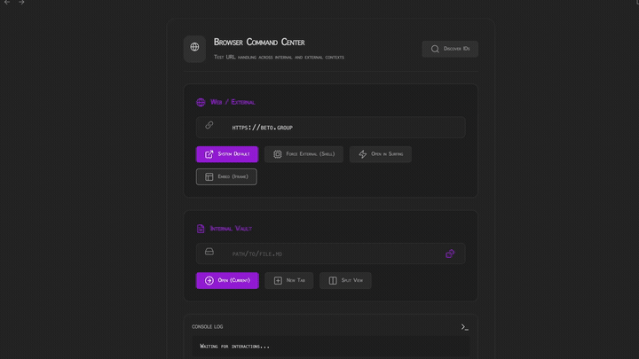
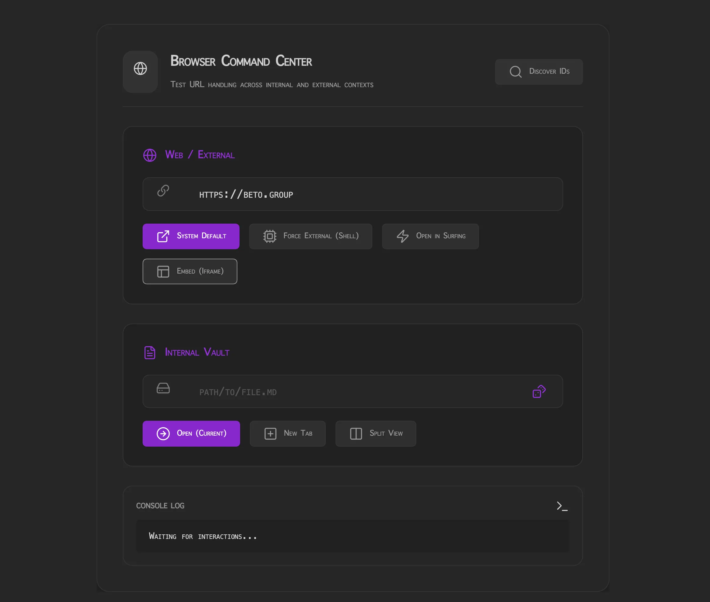

  
  
  <h1 align="center">OPEN BROWSER</h1>
  <h3 align="center"> The Obsidian URL & Vault Link Testing Hub </h3>

  <!-- TOP PURPLE LINKS -->
  
  
  
   
  <!-- BOTTOM GOLD TAXONOMY -->
  
  
  
  

  

    <i> A lightweight utility center for validating external URLs and Obsidian vault link handling interfaces. </i>
  

  

**Open Browser** provides a robust environment to diagnose and test browser links, Electron shell external execution, iframe embedding, and vault file links under varying leaf split modes.

---

## Quick Start

To start using Open Browser today:
1. **Download the Repository**: Clone or download this repository directly into any folder inside your Obsidian vault.
2. **Install Datacore**: Ensure you have the **Datacore** plugin installed and enabled in Obsidian.
3. **Open the Entry Note**: Open the **`OPEN BROWSER.md`** note inside Obsidian to launch the component!

---

## Features

### External URL Actions
*   **System Default Links**: Opens links via standard browser redirection.
*   **Electron Force External**: Bypasses Obsidian routing directly via `electron.shell.openExternal`.
*   **Surfing View Redirects**: Integrates with Surfing view types for seamless tab management.
*   **Iframe Embedding**: Embeds and previews pages instantly inside a sandbox container.

### Internal Vault Link Validation
*   **Target Splits**: Resolves local paths to open files in current view, new tabs, or split columns.
*   **Random Selector**: Picks a random markdown file in the vault for path validation.

### Runtime & Reliability
*   **Watchdog Reload**: Safe-daemon hot reload loops run continuously, ensuring instant updates.
*   **Adaptive Themes**: Inherits the host workspace appearance via Obsidian standard CSS variables.

---

## Directory Index & Components

The package exposes the following files:

| File | Description |
| :--- | :--- |
| **[OPEN BROWSER.md](OPEN%20BROWSER.md)** | Standard Datacore wrapper note interface. |
| **[src/index.jsx](src/index.jsx)** | Main bootstrap loader and watch daemon. |
| **[src/App.jsx](src/App.jsx)** | Main React controller layout and styles. |
| **[METADATA.md](METADATA.md)** | Machine-readable package packaging manifest. |
| **[CONTRIBUTION.md](CONTRIBUTION.md)** | Development guidelines and structure mapping. |
| **[LICENSE.md](LICENSE.md)** | MIT open-source license documentation. |

---

## Previews

| Static Mockup | Interactive Dashboard |
| :---: | :---: |
|  |  |

---

## Contributors
- beto.group
